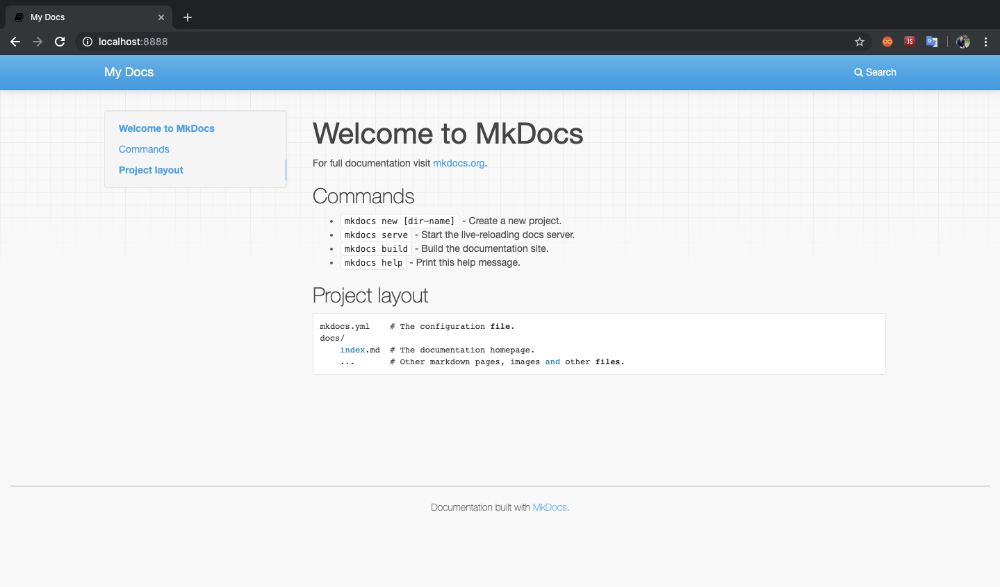
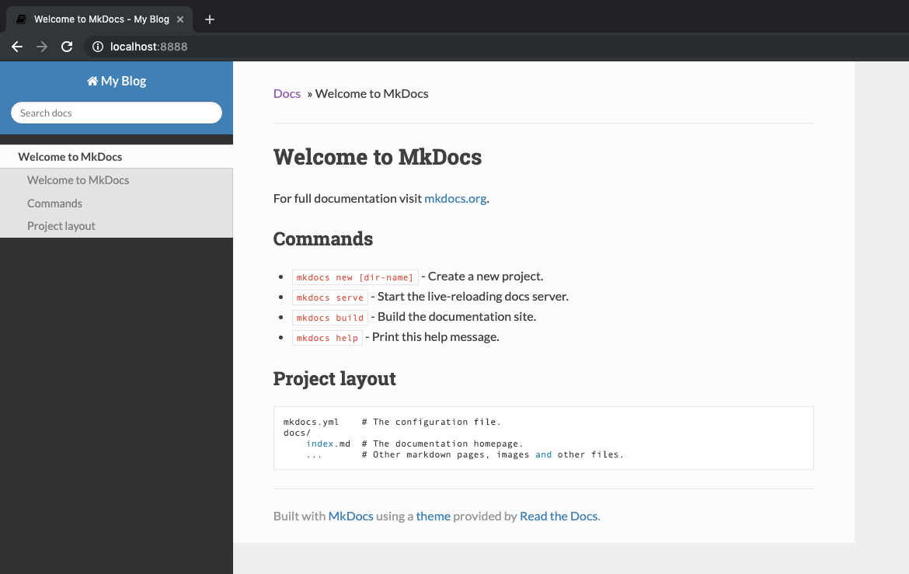
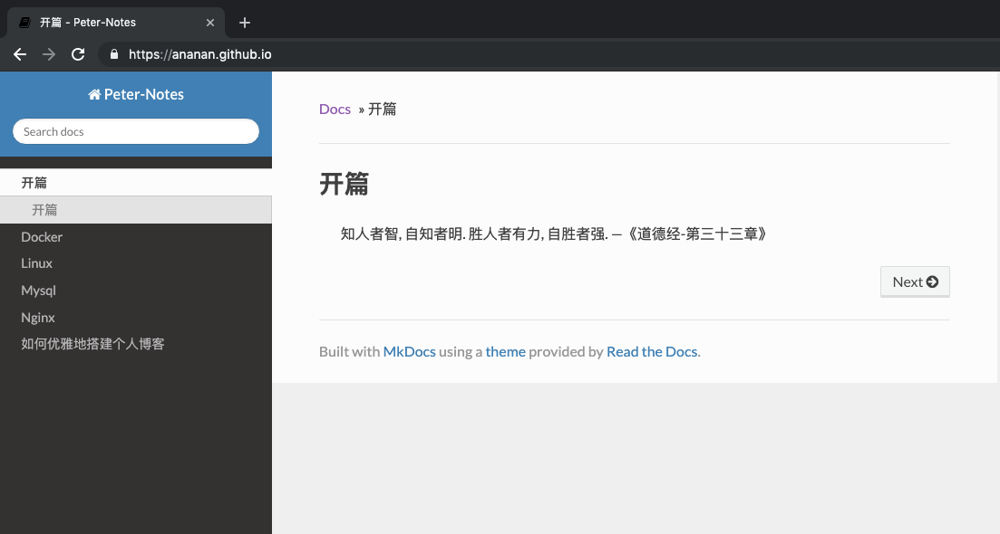

# 如何优雅地搭建个人博客

# 为什么要搭建个人博客?

### 1. 好记性不如烂笔头

​	随着年龄的增长, 记忆力衰退不可避免. 在学习和工作中很多经验都可以通过博客记录下来, 同时写博客也是一种反思总结的过程. 否则一味依赖于搜索引擎, 个人知识体系难已建立.

### 2. 碎片化网络时代下的自我审视

​	当下随着移动互联网的快速发展, 智能设备终端的快速普及, 网上“地球村”基本已经实现, 微信、Facebook加起来已超过地球近半人口, 更别说微博、推特等公众社交媒体. 各种观点、视野、思想在碰撞, 网络碎片化已成现实, 如何在这个网络时代下寻求自我审视的空间, 个人博客是一种较好的方式.

# 搭建个人博客方式有哪些?

### 1. 小白流

​	在博客园、简书、CSDN、知乎专栏或一些类似于Lofter等网站开个账号即可. 

​	此种方式优势是简单快速无门槛, 网站流量大, 认可度高, 高质量文章可轻松获取大量阅读量, 缺点是没什么个性, 缺少定制, 而且文章编辑器往往比较丑, 比如博客园和CSDN的编辑器私以为就比较丑, 这些网站我都写过一些文章, 质量比较水, 都坚持不久就懒得写了.

### 2. 技术流

​	使用开源CMS系统或借用开源框架手动撸一个博客网站对大多数程序员都不是什么难事, 常用的比如CMS 比如WordPress使用简单, 功能插件定制也非常多, 甚至一些电商网站都可以直接套用. 高级一点的, 用Python的Django/Flask或Golang直接搭一个难度也不大, 甚至在搭建过程中可以快速学习到新的语言或框架. 

​	对于这类技术流方式, 除了把软件包开发出来, 如何部署维护你的个人博客就是个问题了. 为了让自己的博客可以分享在互联网上, 你还需要注册个域名, 买个服务器或租个网页空间来部署你的网站, 而部署好后你会发现自己的博客文章几乎没什么阅读量, 因为站点流量太小, 其他用户很难通过搜索引擎看到你的博客. 最终发现劳心费力搞的个人博客只是一个自己的私有网络记事本, 这还蛮打击写作的心态的.

# 最优雅的方式

​	能不能结合以上两种方式的优点, 同时又避免两者的缺点呢? 如果能在本地以Markdown的方式写好博客文档, 然后快速将文档部署到大流量的网站, 方便更多人查阅就好了. 确实还真有. `mkdocs+Git Page`就可以做到, 而且只需要三步即可部署好.

### 1. 下载mkdocs

[mkdocs项目](https://github.com/mkdocs/mkdocs) 是一个可以将markdown文档转化为html页面到开源项目, 我们可以在Linux环境中通过一下命令下载安装它:

```bash
pip3 install mkdocs
```

值得注意的是该项目使用了tornado框架作为开发服务器, 而tornado需要Python3.5以上的版本, 因此如果需要使用pip3来下载, 如果缺少pip3可以使用一下命令安装pip3:

```bash
apt-get install python3-pip
```

### 2. 编写博客

写博客之前我们需要创建一个mkdocs项目:

```bash
cd /home/peter/blog
~/blog mkdocs new gitpage
INFO    -  Creating project directory: gitpage
INFO    -  Writing config file: gitpage/mkdocs.yml
INFO    -  Writing initial docs: gitpage/docs/index.md
~/blog ls
gitpage 
```

创建好项目后可以直接运行:

```bash
~/blog/gitpage ls
docs       mkdocs.yml
~/blog/gitpage mkdocs serve -a 0.0.0.0:8888
INFO    -  Building documentation...
INFO    -  Cleaning site directory
[I 190714 23:29:36 server:283] Serving on http://0.0.0.0:8888
[I 190714 23:29:36 handlers:60] Start watching changes
[I 190714 23:29:36 handlers:62] Start detecting changes
```

然后打开浏览器复制上面的链接即可看到效果:



可以改一下主题和站点名称:

```bash
~/blog/gitpage vi mkdocs.yml
~/blog/gitpage cat mkdocs.yml
site_name: My Blog
theme: readthedocs
```

重新跑起来, 打开浏览器即可看到效果:



然后用你喜爱的Markdown编辑工具打开gitpage这个目录, 在docs里新建markdown文档写作即可, 我个人推荐使用 [Typora编辑器](https://www.typora.io/), 开源, 界面漂亮, 功能齐全, Markdown文档还可边写边预览效果, 导出的word和pdf文档的功能也很实用, 平时工作写文档必备神器


### 3. 部署博客

上面我们在docs目录下编写好了我们的文档, 这时候只需使用如下命令即可转换成html页面:

```
~/blog/gitpage mkdocs build
INFO    -  Cleaning site directory
INFO    -  Building documentation to directory: /Users/peter/blog/gitpage/site
~/blog/gitpage ls
docs       mkdocs.yml site
~/blog/gitpage ls site
404.html    css         fonts       img         index.html  js          search      search.html sitemap.xml
```

在你的git仓库中新建一个git page仓库, 然后将上述site目录复制到新建的git page仓库里, push到master分支即可完成部署, 部署完成后效果:



最终整个博客就可以相当于一个git仓库维护即可, 平时使用Typora等编辑器本地编写好博客, mkdocs serve命令即时预览, 然后将改动推送到远程master分支即可.